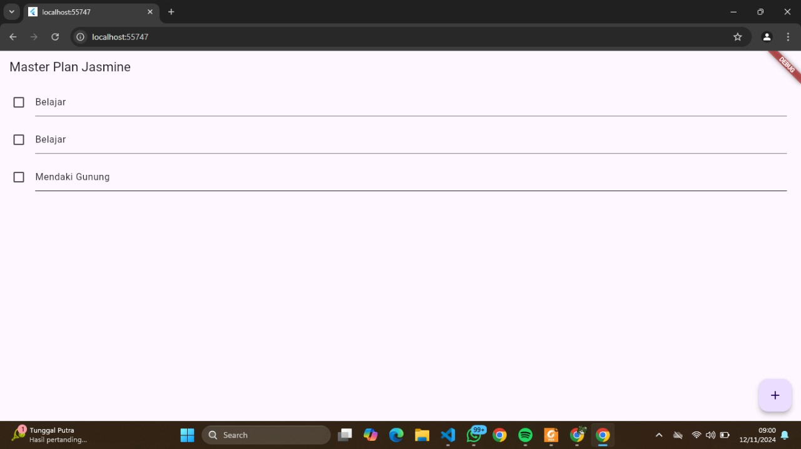
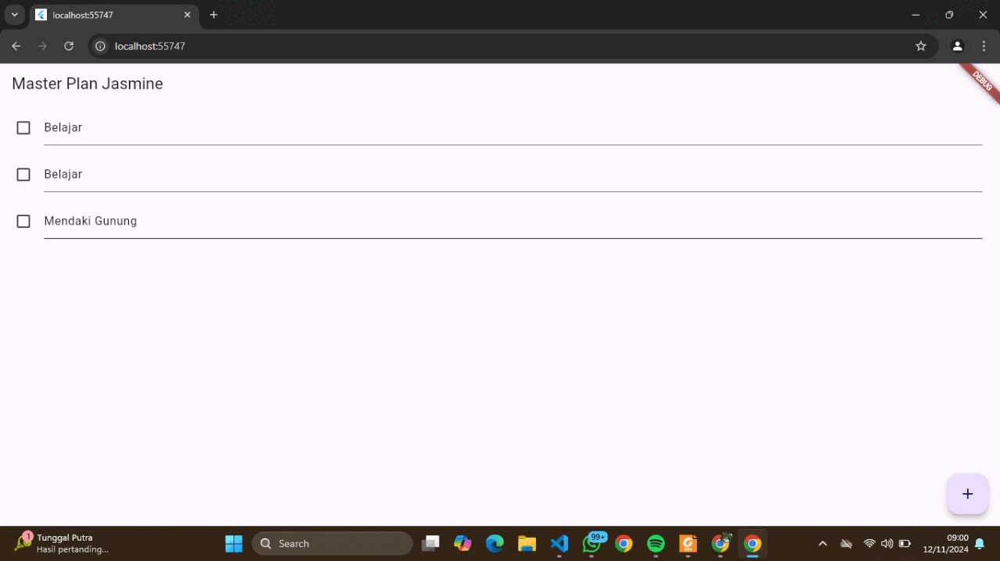

# dasarstate
# Jasmine Az Zahra Ihsani 362358302096

# 2. Langkah 4 bertujuan untuk membuat file data_layer.dart sebagai titik akses pusat untuk mengimpor model-model yang diperlukan dalam aplikasi, yaitu plan.dart dan task.dart. Dengan cara ini, semua file atau widget yang memerlukan model Plan dan Task cukup mengimpor data_layer.dart daripada mengimpor setiap model secara individual.

# 3. Variabel plan pada langkah 6 di dalam file plan_screen.dart berfungsi untuk menyimpan data yang berkaitan dengan rencana yang sedang dibuat atau dikelola dalam aplikasi. Variabel ini digunakan untuk menyimpan informasi dan daftar tugas yang terkait dengan rencana tersebut dan memungkinkan aplikasi untuk menampilkan serta mengubah data rencana tersebut saat aplikasi berjalan.

# 5. initState(): Inisialisasi ScrollController dan tambahkan listener sebelum widget pertama kali dirender. dispose(): Bersihkan ScrollController saat widget dihapus dari widget tree untuk menghindari kebocoran memori. Mengelola resource seperti ScrollController dengan benar dalam lifecycle widget adalah bagian penting dalam menjaga performa dan stabilitas aplikasi.
