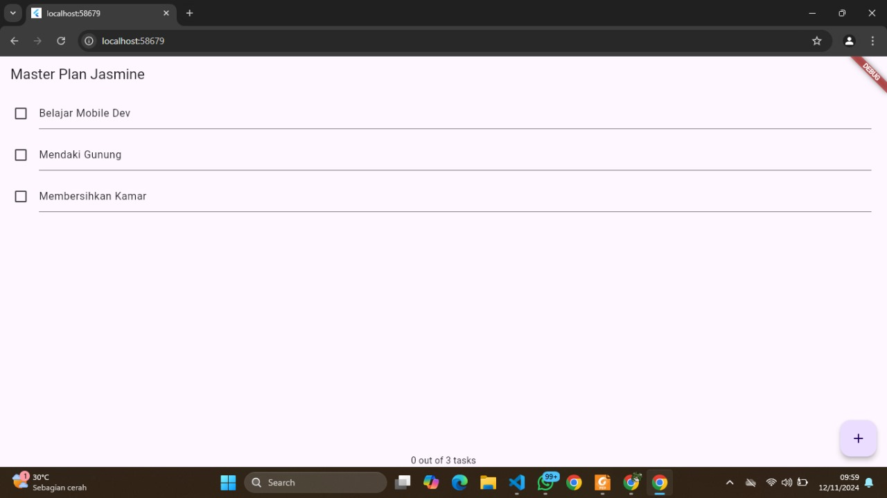
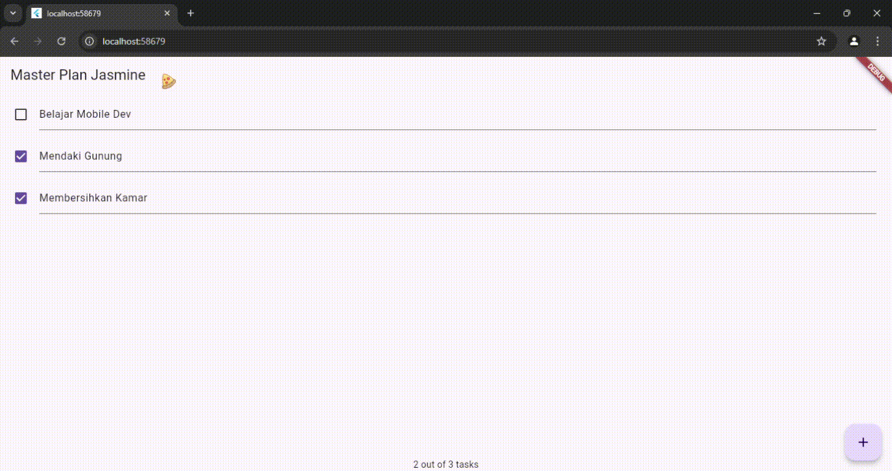
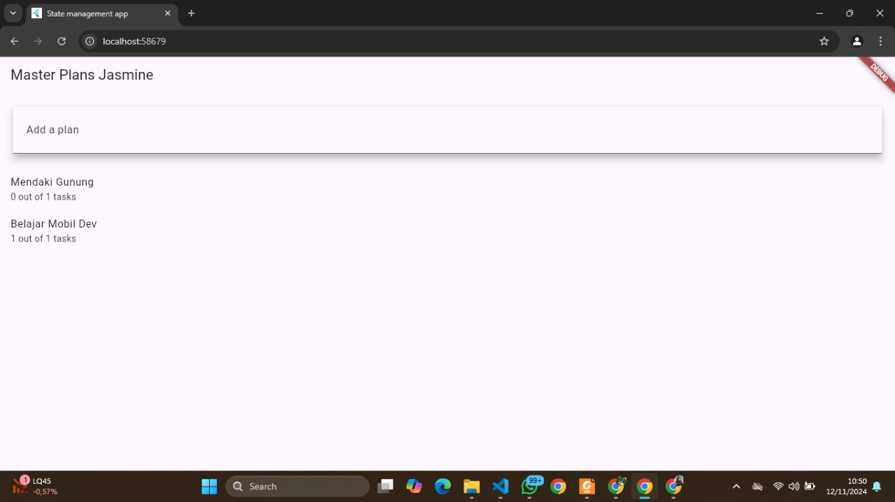
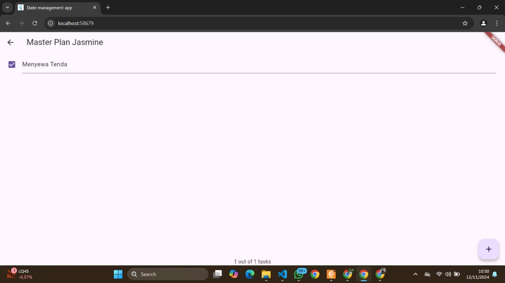
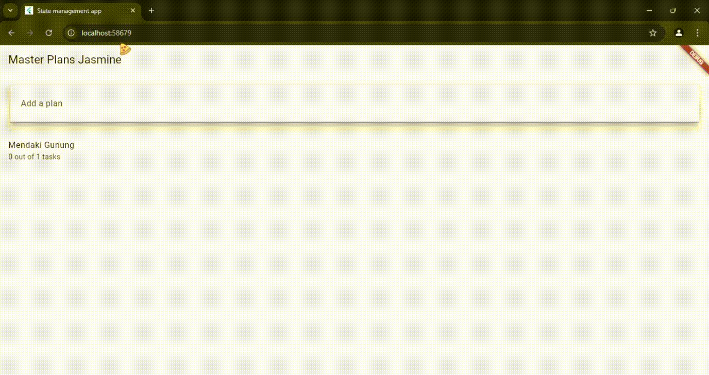

# dasarstate
# Jasmine Az Zahra Ihsani 362358302096

# PRAKTIKUM 1

# 2. Langkah 4 bertujuan untuk membuat file data_layer.dart sebagai titik akses pusat untuk mengimpor model-model yang diperlukan dalam aplikasi, yaitu plan.dart dan task.dart. Dengan cara ini, semua file atau widget yang memerlukan model Plan dan Task cukup mengimpor data_layer.dart daripada mengimpor setiap model secara individual.

# 3. Variabel plan pada langkah 6 di dalam file plan_screen.dart berfungsi untuk menyimpan data yang berkaitan dengan rencana yang sedang dibuat atau dikelola dalam aplikasi. Variabel ini digunakan untuk menyimpan informasi dan daftar tugas yang terkait dengan rencana tersebut dan memungkinkan aplikasi untuk menampilkan serta mengubah data rencana tersebut saat aplikasi berjalan.

# 5. initState(): Inisialisasi ScrollController dan tambahkan listener sebelum widget pertama kali dirender. dispose(): Bersihkan ScrollController saat widget dihapus dari widget tree untuk menghindari kebocoran memori. Mengelola resource seperti ScrollController dengan benar dalam lifecycle widget adalah bagian penting dalam menjaga performa dan stabilitas aplikasi.

# PRAKTIKUM 2

# count task

# 2. InheritedWidget digunakan untuk menyebarkan data ke widget-widget anak dalam widget tree, tetapi tidak memiliki mekanisme untuk mengupdate widget secara otomatis saat data berubah. Untuk itu, InheritedNotifier digunakan agar kita bisa menggabungkan kemampuan untuk membagikan data (seperti pada InheritedWidget) dengan kemampuan untuk meng-notifikasi perubahan data secara otomatis (seperti pada ValueNotifier). Dengan ini, kita bisa memperbarui dan menyebarkan perubahan data Plan secara lebih efisien ke seluruh aplikasi tanpa memerlukan boilerplate code yang berlebihan.

# 3. Langkah 3 menambahkan dua metode di dalam class Plan: completedCount: Menghitung jumlah tugas yang selesai (task.complete == true) dengan cara memfilter daftar tasks dan menghitung panjangnya. completenessMessage: Mengembalikan pesan yang menunjukkan progres tugas, yaitu jumlah tugas selesai dibandingkan total tugas. Kedua metode ini digunakan untuk memberikan informasi tentang status tugas yang selesai di dalam Plan.

# PRAKTIKUM 3 

# 2. Diagram ini menunjukkan struktur widget dan alur navigasi pada aplikasi Flutter untuk praktik master plan: Struktur Awal (Kiri): Aplikasi dimulai dengan MaterialApp, diikuti oleh PlanProvider dan PlanCreatorScreen. Dalam PlanCreatorScreen, terdapat Column dengan TextField (input teks) dan Expanded yang berisi ListView untuk menampilkan daftar. Navigasi dengan Navigator Push: Panah menunjukkan navigasi menggunakan Navigator.push ke layar baru, yaitu PlanScreen. Struktur Layar Setelah Navigasi (Kanan): PlanScreen memiliki Scaffold sebagai struktur utama. Di dalamnya terdapat Column dengan Expanded, SafeArea, ListView, dan Text untuk memastikan konten tampil rapi di area yang aman.